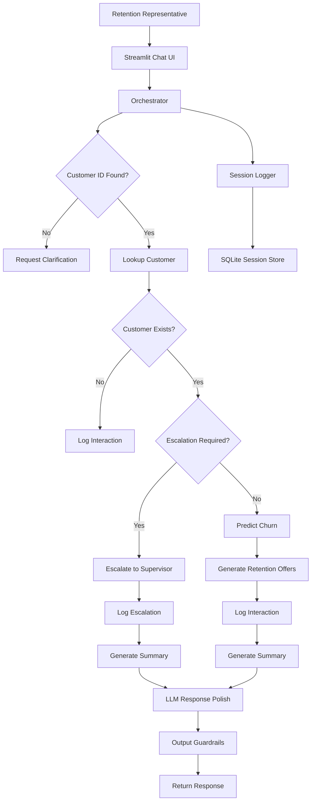

# 📞 TeleConnect Retention Assistant

An AI-powered customer retention assistant that helps customer service representatives identify churn risk, recommend personalized retention strategies, and manage customer interactions through a deterministic workflow with optional LLM-powered response polishing.

Built with **Streamlit**, **Machine Learning**, **MLflow**, **SQLite**, and **Groq LLMs**, the application combines explainable business logic with natural-language interaction to provide consistent, auditable customer support.

---

## ✨ Features

- 🔍 Customer profile lookup
- 🗄 Customer lookup uses SQLite first with JSON fallback
- 📉 Machine Learning-based churn prediction
- 🎁 Personalized retention offer recommendations
- 🚨 Automatic supervisor escalation based on business guardrails
- 🤖 Optional LLM polishing for professional responses
- 📋 Session-level audit logging (JSONL & Text)
- 🗄 SQLite-backed session monitoring dashboard
- 📊 MLflow model loading and version management
- 🛡 Input and output guardrails
- 💬 Streamlit chat interface

---

# 🏗 Architecture

The application follows a **deterministic orchestration model**.

Business decisions are **never delegated to the LLM**.

Instead,

- Customer lookup
- Churn prediction
- Offer selection
- Escalation
- Interaction logging

are performed through deterministic tools.

The LLM is only responsible for improving the tone and readability of the final response.

---

## Architecture Flow



---

# 🔄 End-to-End Workflow

```
Representative Message
        │
        ▼
Input Guardrails
        │
        ▼
Customer Lookup
        │
        ▼
Escalation Decision
        │
        ├──────────────► Escalation Workflow
        │
        ▼
Churn Prediction
        │
        ▼
Retention Offer Generation
        │
        ▼
Interaction Logging
        │
        ▼
LLM Response Polishing
        │
        ▼
Output Guardrails
        │
        ▼
Streamlit Chat Interface
```

---

# 🛠 Tech Stack

| Layer | Technology |
|--------|------------|
| Frontend | Streamlit |
| Language | Python |
| Machine Learning | Scikit-Learn |
| Model Registry | MLflow |
| Database | SQLite |
| LLM | Groq API |
| Logging | JSONL + Text Logs |
| Environment | python-dotenv |
| Data Processing | Pandas, NumPy |

---

# 📂 Project Structure

```
Churn_Prediction/

├── app.py
├── requirements.txt
├── README.md
├── .env
│
├── data/
│   ├── Val_data/
│   ├── Output_data/
│   ├── SQLite_storage/
│   └── images/
│
├── logs/
├── mlruns/
├── mlartifacts/
│
├── prompts/
│   └── retention_polish_system_prompt.md
│
├── notebooks/
│
├── SQLlite_sync/
│
└── src/
    ├── predictor.py
    ├── model_loader.py
    ├── session_store.py
    │
    ├── retention_agent/
    │   ├── orchestrator.py
    │   ├── messaging.py
    │   ├── runtime.py
    │   ├── guardrails.py
    │   ├── prediction_engine.py
    │   ├── chat_panel.py
    │   └── ...
    │
    └── tools/
        ├── customer_tools.py
        ├── offer_tools.py
        ├── engagement_tools.py
        └── dispatch.py
```

---

# ⚙️ Core Components

### Streamlit UI

- Chat interface
- Session monitoring sidebar
- Customer profile panel
- Prediction panel

---

### Orchestrator

Coordinates the complete deterministic workflow.

Responsibilities include:

- Guardrail validation
- Customer lookup
- Escalation routing
- Churn prediction
- Offer generation
- Interaction logging
- LLM response polishing

---

### Customer Data Source Strategy

`lookup_customer` uses a deterministic source priority for validation/customer data:

1. **Primary**: SQLite table `customer_validation_data` in `data/SQLite_storage/retention_sessions.db`
2. **Fallback**: JSON files in `data/Val_data`

This means customer lookup remains available even if SQLite is temporarily unavailable.

The `lookup_customer` response now includes:

- `source`: `sqlite` or `json_fallback`
- `source_path`: the configured validation data directory path

---

### Prediction Engine

Responsible for

- loading MLflow models
- preprocessing customer features
- predicting churn probability
- validating prediction outputs

---

### Messaging Engine

Generates structured customer summaries and optionally enhances them using the configured Groq LLM while preserving deterministic business decisions.

---

### Runtime Logger

Creates

- JSONL audit logs
- Plain text logs
- Session events
- SQLite monitoring records

---

# 🚀 Getting Started

## Clone Repository

```powershell
git clone <repository-url>

cd Churn_Prediction
```

---

## Create Virtual Environment

```powershell
python -m venv .venv

.\.venv\Scripts\Activate.ps1
```

---

## Install Dependencies

```powershell
pip install --upgrade pip

pip install -r requirements.txt
```

If PowerShell blocks activation:

```powershell
Set-ExecutionPolicy RemoteSigned -Scope CurrentUser
```

---

# 🔑 Environment Variables

Create a `.env` file in the project root.

```env
GROQ_API_KEY=your_api_key

GROQ_MODEL_PREDICT=model_name

GROQ_MODEL_JUDGE=model_name

MLFLOW_TRACKING_URI=http://localhost:5000

MLFLOW_MODEL_URI=runs:/<run_id>/model
```

---

# ▶ Running the Application

```powershell
streamlit run app.py
```

Open

```
http://localhost:8501
```

---

# 📊 MLflow

The application supports both

- Local artifacts
- Remote MLflow tracking servers

Model loading strategy

1. Local MLflow artifacts
2. Remote tracking server
3. Registry validation

Launch MLflow UI

```powershell
mlflow ui `
--backend-store-uri sqlite:///mlflow.db `
--default-artifact-root ./mlartifacts `
--host 0.0.0.0 `
--port 5000
```

---

# 🗄 SQLite Session Monitoring

Every conversation is stored inside SQLite.

Tracked information includes

- Session ID
- Customer lookup
- Prediction events
- Offers generated
- Escalation events
- Final responses
- Runtime metrics

Database location

```
data/SQLite_storage/retention_sessions.db
```

---

# 📝 Audit Logging

Each session automatically generates

```
logs/

├── session_id.jsonl
└── session_id.log
```

Interaction records are also stored as

```
data/Output_data/

session_interactions.jsonl

session_escalations.jsonl
```

This provides complete traceability of every customer interaction.

---

# 💬 Example Conversation

**Representative**

```
Customer TC-000171 wants to cancel due to high pricing.
```

**Assistant**

```
Customer Found ✔

Churn Risk
High (89%)

Recommended Offers

• 20% Loyalty Discount
• Premium Plan Free Trial

Suggested Action

Offer the loyalty discount first.

Escalation

Not Required
```

---

# 📸 Screenshots

Add screenshots here.

```
docs/

├── dashboard.png

├── chat.png

├── prediction.png

└── session_monitor.png
```

Example

```markdown


```

---

# 🔮 Future Enhancements

- Authentication and role-based access
- CRM integration
- Multi-agent orchestration
- Docker deployment
- Kubernetes support
- Real-time analytics dashboard
- Model performance monitoring
- Vector search for customer interaction history

---

# 🧪 Evaluation Framework and LLM-as-Judge

An end-to-end evaluation pipeline is included under the `evaluation/` package.

It provides:

- A structured test suite with 14 labeled cases covering:
        - single-tool happy path
        - multi-step chaining
        - ambiguous input
        - out-of-scope request
        - escalation triggers
        - model disagreement
        - adversarial and edge scenarios
- Automated metrics:
        - status match
        - tool selection accuracy
        - parameter extraction accuracy
        - response completeness
        - hallucination detection
- Optional LLM-as-judge scoring with a separate model call and rubric-based anchors.

LLM-as-judge dimensions (anchored):

- factual_correctness
- tool_use_appropriateness
- actionability_for_representative
- hallucination_control

Anchor style used in judging:

- low anchor: incorrect, unsafe, or unsupported behavior
- mid anchor: partially correct with meaningful gaps
- high anchor: correct, grounded, and actionable

Run evaluation (automated metrics only):

```powershell
python scripts/run_evaluation.py
```

Run evaluation with LLM-as-judge enabled:

```powershell
python scripts/run_evaluation.py --use-judge
```

Run a smoke subset:

```powershell
python scripts/run_evaluation.py --max-cases 3
```

Output artifacts are written to a timestamped folder in:

```
data/evaluation_metrics/eval_run_<timestamp>/

aggregate_report.json
case_results.jsonl
leaderboard.md
```

Note: `data/metrics_and_params/` remains reserved for Optuna and hyperparameter tuning artifacts.

`aggregate_report.json` includes overall and per-category summaries.

Quality gates are also included in `aggregate_report.json` under `quality_gates` with:

- explicit hard checks (must pass)
- explicit soft checks (target thresholds)
- `pass` flag for CI-style gating

`leaderboard.md` provides a compact markdown ranking of cases, category rollups, and lowest-scoring cases.

Judge reliability guidance is documented and should be reviewed before production gating:

- inter-rater consistency checks
- prompt sensitivity checks
- calibration against human labels
- drift monitoring by category

Reference docs for meeting walkthrough:

- `docs/evaluation/LLM_as_Judge_Flow.md`
- `docs/evaluation/Test_Cases_Handbook.md`
- `docs/evaluation/Teams_Meeting_Talk_Track.md`

---

# 🧪 Development

The repository also contains notebooks for

- Data Cleaning
- Exploratory Data Analysis
- Feature Engineering
- Hyperparameter Tuning
- Model Training
- SQLite Exploration

---

# 📄 License

This project is licensed under the MIT License.

---

# 👨‍💻 Author

**Your Name**

GitHub: https://github.com/yourusername

LinkedIn: https://linkedin.com/in/yourprofile