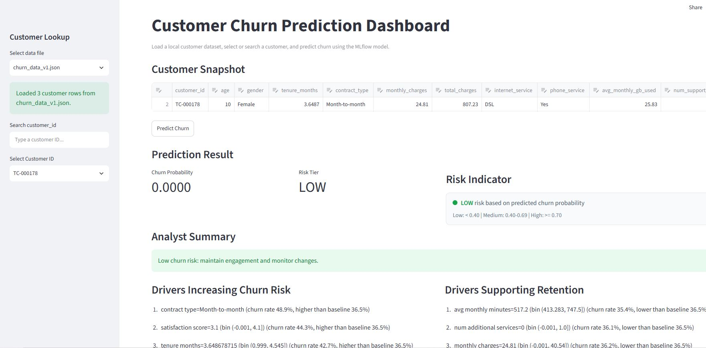
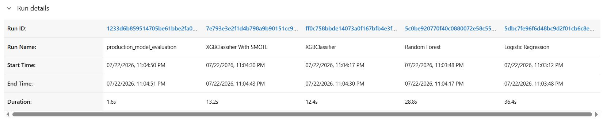
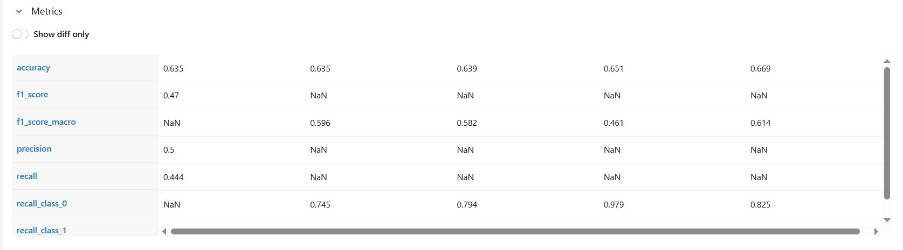
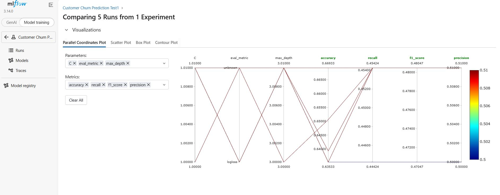

# Churn Prediction App (Streamlit + MLflow)

This project is a customer churn prediction application with:

- A Streamlit UI for loading local customer files and running churn predictions.
- MLflow model loading from a tracking server and local artifacts.
- JSON prediction output saved for each customer run.

## 1) Project Layout

```text
Churn_Prediction/
├─ .devcontainer/
├─ .venv/
├─ .gitignore
├─ app.py
├─ requirements.txt
├─ mlflow.db
├─ README.md
├─ data/
│  ├─ images/
│  ├─ Input_data/
│  │  └─ churn_data_v1.json
│  ├─ metrics_and_params/
│  │  └─ trials.csv
│  ├─ Output_data/
│  │  └─ *.json
│  ├─ Pre_processed_data/
│  │  └─ churn_data_v1_20260721_161051.csv
│  ├─ raw_data/
│  │  └─ test_datafile.csv
│  └─ SQLite_storage/
├─ logs/
├─ mlartifacts/
├─ mlruns/
├─ notebooks/
│  ├─ Data_Analysis/
│  │  └─ churn_data_cleaning.ipynb
│  ├─ EDA/
│  │  └─ churn_data_EDA.ipynb
│  ├─ Hyperparameter Tuning/
│  │  └─ Training_HyperparameterTune.ipynb
│  └─ Model_Training/
│     ├─ churn_pred_ml_flow.ipynb
│     └─ churn_pred_tunning.ipynb
└─ src/
   ├─ __init__.py
   ├─ config.py
   ├─ data_loader.py
   ├─ logger_utils.py
   ├─ model_loader.py
   ├─ predictor.py
   └─ verify_prediction.py
```

## 2) Python Environment (.venv)

This repository already includes a local virtual environment in `.venv`.

### PowerShell (Windows)

```powershell
cd D:\Churn_Prediction
.\.venv\Scripts\Activate.ps1
```

If script execution is blocked:

```powershell
Set-ExecutionPolicy -ExecutionPolicy RemoteSigned -Scope CurrentUser
```

### Install/refresh dependencies

```powershell
python -m pip install --upgrade pip
pip install -r requirements.txt
```

## 3) Run the App

After activating `.venv`:

```powershell
streamlit run app.py
```

Then open the local URL shown by Streamlit (usually `http://localhost:8501`).

## 4) Data Input and Prediction Output

- Input files are loaded from: `data/Input_data`
- Supported input types: `.csv`, `.xlsx`, `.json`
- Output prediction JSON files are written to: `data/Output_data`
- Application log file: `logs/app.log`

## 5) MLflow Access

The app reads MLflow settings from `src/config.py`:

- `MLFLOW_TRACKING_URI = "http://localhost:5000"`
- `MLFLOW_RUN_ID = "7e793e3e2f1d4b798a9b90151cc9c8fb"`
- `MODEL_NAME = "XGBClassifier With SMOTE"`
- `MLFLOW_MODEL_URI = "runs:/7e793e3e2f1d4b798a9b90151cc9c8fb/model"`

### Start MLflow UI from this project

```powershell
cd D:\Churn_Prediction
.\.venv\Scripts\mlflow.exe ui --backend-store-uri sqlite:///mlflow.db --default-artifact-root ./mlartifacts --host 0.0.0.0 --port 5000
```

Open: `http://localhost:5000`

### Model loading behavior in app

`src/model_loader.py` tries model URIs in order (registry aliases/version, run URI), then falls back to loading local artifact paths if needed.

## 6) Useful MLflow Commands

With `.venv` active:

```powershell
mlflow experiments list
mlflow runs list --experiment-id 1
```
## 7) Images

### Streamlit App Output

Live app: https://churn-prediction-koa9fbmuzetbwk3pgxze6s.streamlit.app/









## 8) Notes

- This project currently imports `src.predictor` in `app.py` and `src/verify_prediction.py`.
- Ensure that module exists in your working copy when running prediction flow.
