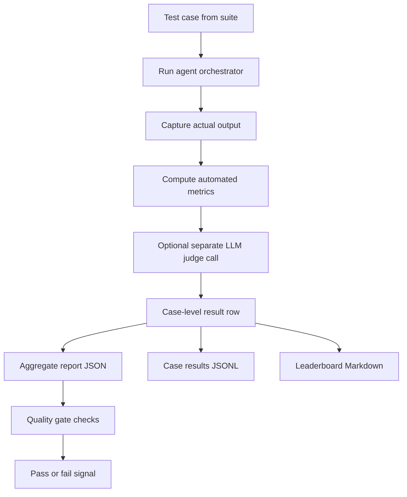

# LLM-as-a-Judge Flow (Meeting Guide)

## 1) Why this exists
This evaluation framework helps us answer one question reliably:

- Is the retention agent making correct, safe, and useful decisions for representatives?

It does this with two layers:

- Deterministic automated metrics
- A separate LLM-as-judge rubric scorer

## 2) End-to-end flow


## 3) Inputs and outputs at each stage
### Input
- Structured case definition from evaluation suite
- User prompt
- Expected tool order and key parameters
- Quality criteria

### Output
- Agent response text
- Tool trace
- Per-metric scores
- Judge rubric scores (if enabled)
- Quality gates and leaderboard

## 4) What is scored automatically
The runner computes these metrics per case:

- status_match
- tool_selection_accuracy
- parameter_extraction_accuracy
- response_completeness
- hallucination_detection

These are deterministic and reproducible.

## 5) What the LLM judge adds
A separate judge model scores four anchored dimensions (0 to 4):

- factual_correctness
- tool_use_appropriateness
- actionability_for_representative
- hallucination_control

Weighted total is produced on a 0 to 100 scale.

## 5.1) Dimension anchors (explicit)
Each dimension uses concrete anchors so scoring is not subjective.

| Dimension | Low anchor | Mid anchor | High anchor |
|---|---|---|---|
| factual_correctness | 0: core facts conflict with evidence or are fabricated | 2: mostly correct but has meaningful factual gap | 4: fully aligned with tool_trace and case context |
| tool_use_appropriateness | 0: critical tool misuse or wrong path | 2: mostly correct path with one notable tool mistake | 4: correct tools, order, and purpose |
| actionability_for_representative | 0: not actionable for rep | 2: partially actionable, missing key next step | 4: clear and directly usable next actions |
| hallucination_control | 0: unsupported claims present | 2: minor speculation or weak grounding | 4: no unsupported claims; evidence-linked |

## 5.2) Why these metrics matter most
- tool_selection_accuracy: core workflow integrity.
- parameter_extraction_accuracy: wrong args create silent execution errors.
- response_completeness: rep cannot act if essential details are missing.
- hallucination_detection: safety and trust in customer operations.

## 6) Quality gate logic (current)
### Hard checks
- Hallucination guard on escalation and adversarial categories
- Exact status match across all cases

### Soft checks
- Overall tool accuracy threshold
- Overall response completeness threshold
- Overall hallucination threshold
- Category-specific thresholds (happy path, chaining)
- Model disagreement completeness threshold
- Judge weighted threshold when judge is enabled

## 7) Files that implement this
- Suite definitions: evaluation/test_suite.py
- Automated metrics: evaluation/metrics.py
- Judge logic: evaluation/judge.py
- Runner + gates + leaderboard: evaluation/runner.py
- CLI entrypoint: scripts/run_evaluation.py

## 8) How to run
From project root:

```powershell
python scripts/run_evaluation.py
```

Judge enabled:

```powershell
python scripts/run_evaluation.py --use-judge
```

## 9) Artifacts generated
Each run writes:

- aggregate_report.json
- case_results.jsonl
- leaderboard.md

Default location:

- data/evaluation_metrics/eval_run_<timestamp>/

## 10) How to explain this in 30 seconds
- We test the agent on a fixed scenario suite.
- We score tool behavior and response quality automatically.
- We add an independent LLM judge with a strict rubric for nuanced quality.
- We apply quality gates for release confidence.
- We publish a leaderboard and category trends for discussion.

## 11) Reliability of the judge (meta-question)
We treat judge outputs as measured signals, not absolute truth.

### Practical reliability controls
- Inter-rater consistency: run at least two judge models or two prompt variants on a sample and compare agreement.
- Positivity bias check: include intentionally flawed responses and verify scores drop as expected.
- Prompt sensitivity test: rephrase the same case minimally and ensure score variance stays within a tight band.
- Calibration against human labels: periodically compare judge scores with human reviewer labels on a stratified subset.
- Drift monitoring: track weekly score distributions by category and alert on sudden shifts.

### Suggested reliability KPI set
- Agreement rate with human labels.
- Correlation between automated metrics and judge weighted score.
- Variance across repeated judge runs for same input.
- False-positive and false-negative rate for hallucination judgments.

### Recommended operating rule
- Use automated metrics as primary release gate.
- Use judge score as secondary quality signal until calibration reaches target agreement.
